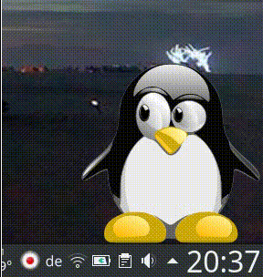

# qt-tuxeyes
A clone of the KDE plasmoid [link](https://store.kde.org/content/show.php/Tux+Eyes?content=120161) written in pure qt. I have done this because the old plasmoid did not work anymore on plasma5.

